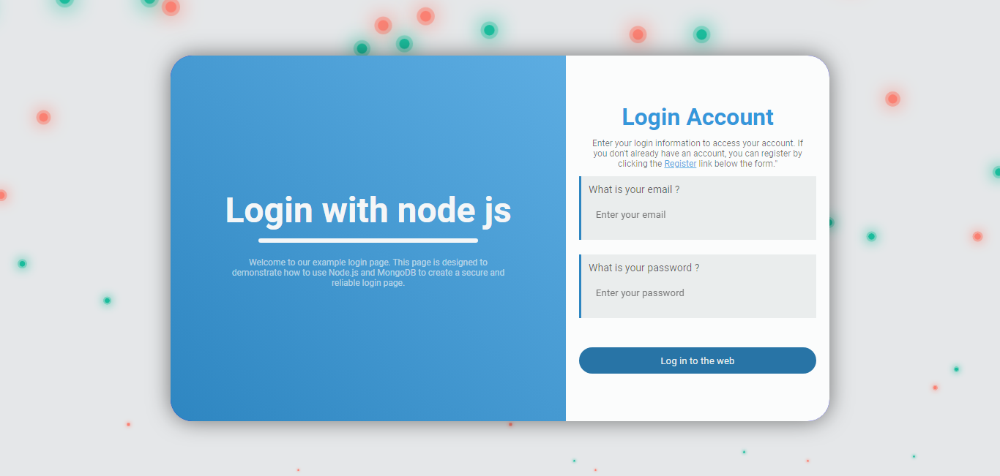
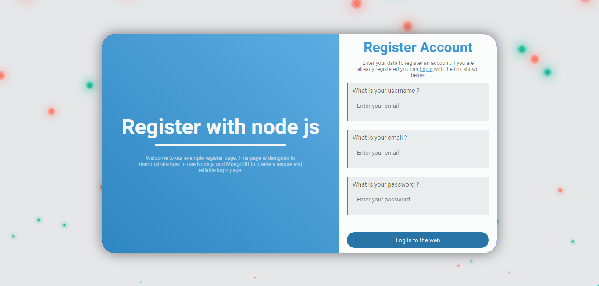
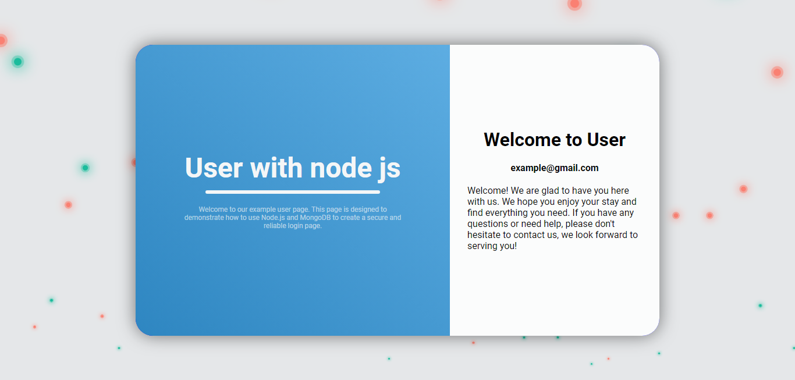

<h1 align="center">User registration with nodejs</h1>

# Description

This user registration web example is developed with Node.js, a JavaScript runtime environment for the server-side platform. In addition, Express, a Node.js web application framework that provides a set of functionality to facilitate the development of web applications and APIs, has been used.

The database used in this example is MongoDB, a NoSQL database management system that allows the storage and fast retrieval of data in JSON format.

In this example, the basic functionalities of a user registration website have been implemented, such as user account creation, user login and authentication, user profile management and forgotten password recovery. In addition, security measures have been implemented to protect user information, such as password encryption and input data validation.

# Why ?

<p align="center">
  
</p>

This sample user registration website has been built with the aim of providing a solid and reliable basis for the development of similar applications. It has been created using state-of-the-art technologies and has been implemented following good development and security practices.

The purpose of this example is to serve as a guide for those interested in learning how to create a user registration website using Node.js, Express and MongoDB. It has been designed to be easy to understand and follow, and has been documented in detail for ease of understanding.

This example can be used as a starting point for the development of similar applications and can be customized and extended according to the needs and requirements of each project. We hope this example will be helpful for those looking to learn how to create a user registration website using these technologies.

# View Proyect



---



---



# Requirements

- Have mongodb installed
- Nodejs installed

# Steps

The first thing to do is to clone the repository, and once cloned enter it with the command cd.

```shell
git clone https://github.com/EddyBel/User-registration-with-nodejs.git
```

```shell
cd User-registration-with-nodejs
```

Once installed we must enter the _"backend"_ folder and there install all the modules necessary for its operation.

```shell
cd backend
```

```shell
npm install
```

Then it is necessary in a second terminal to run the mongodb database.

```shell
mongod
```

Once the mongodb database is running, we can start running the express server, it will run by default on port 3000 and contains a web.config file with the values to set in the api, such as the port or the secret key.

> Note
>
> Remember that this is only a test of record, the safest thing to do is to use environment variables and not expose them in a javascript file.

```shell
npm run dev
```

Finally you must open the file inside the frontend index.html folder and you will be able to use the backend of the web.

# Technologies

- NodeJS
- JavaScript
- Express
- CSS
- HTML
- JSW
- Bcryptjs
